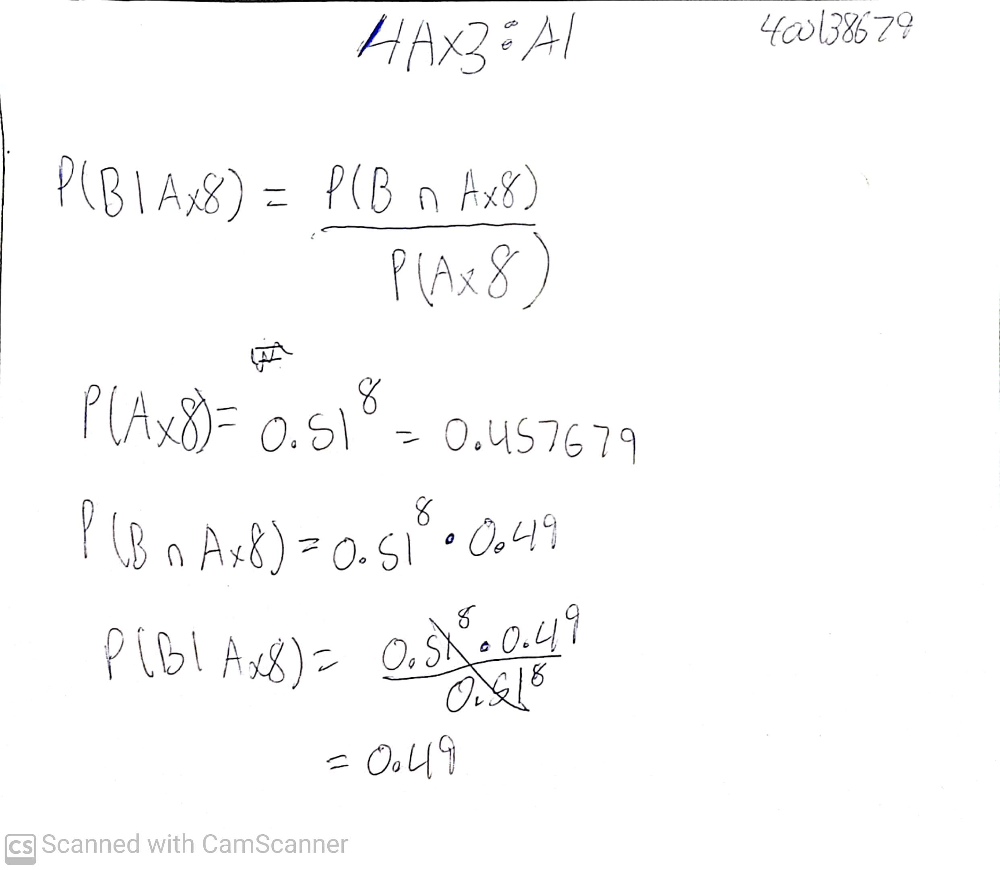
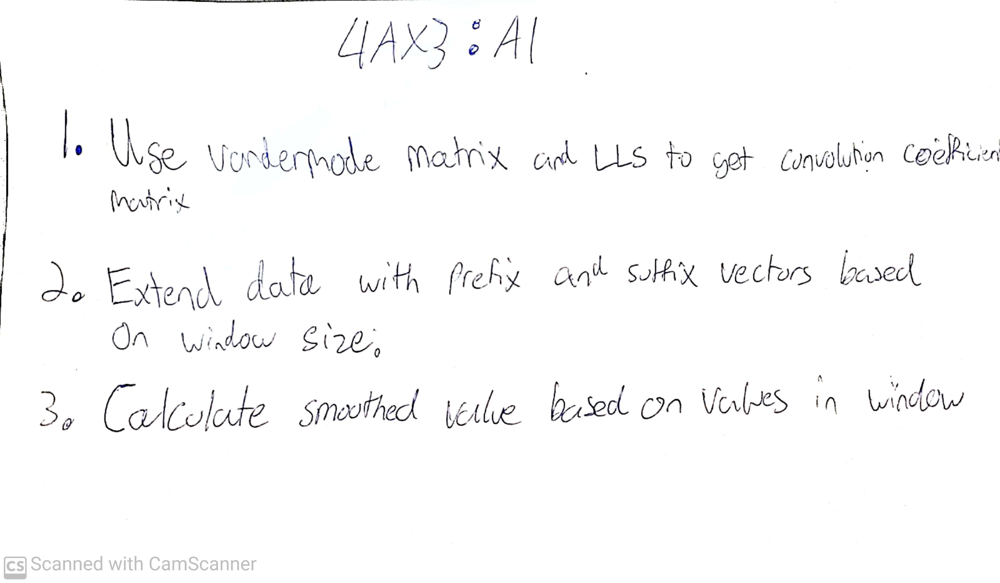
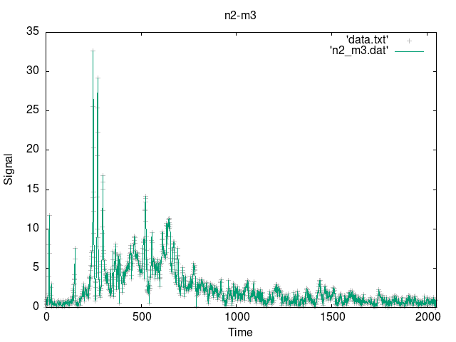
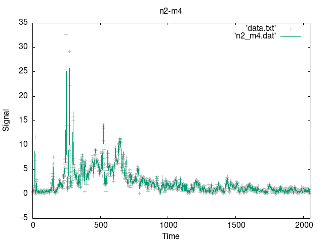
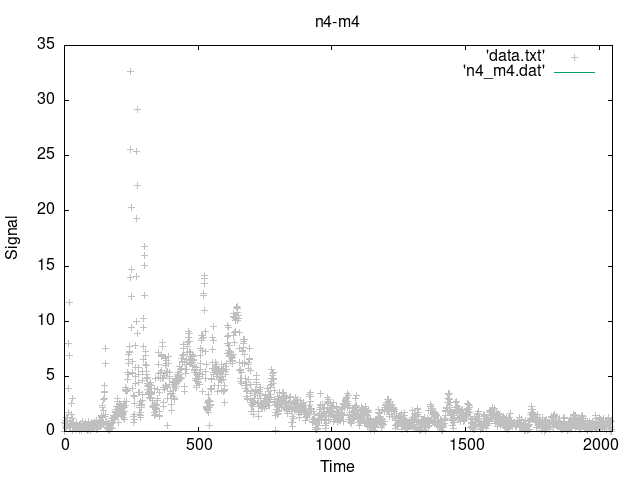
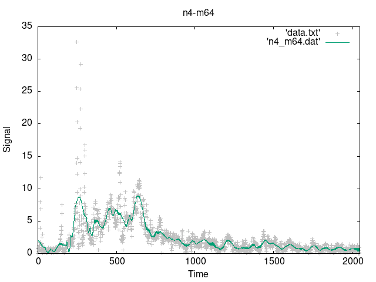

# 400138679 - suitorj - 4AX3 - A1

## Q1

\newpage

## Q2

\newpage

See the included .dat files for the output values used in these graphs.\

This fails because the degree is not less than the number of points.\

