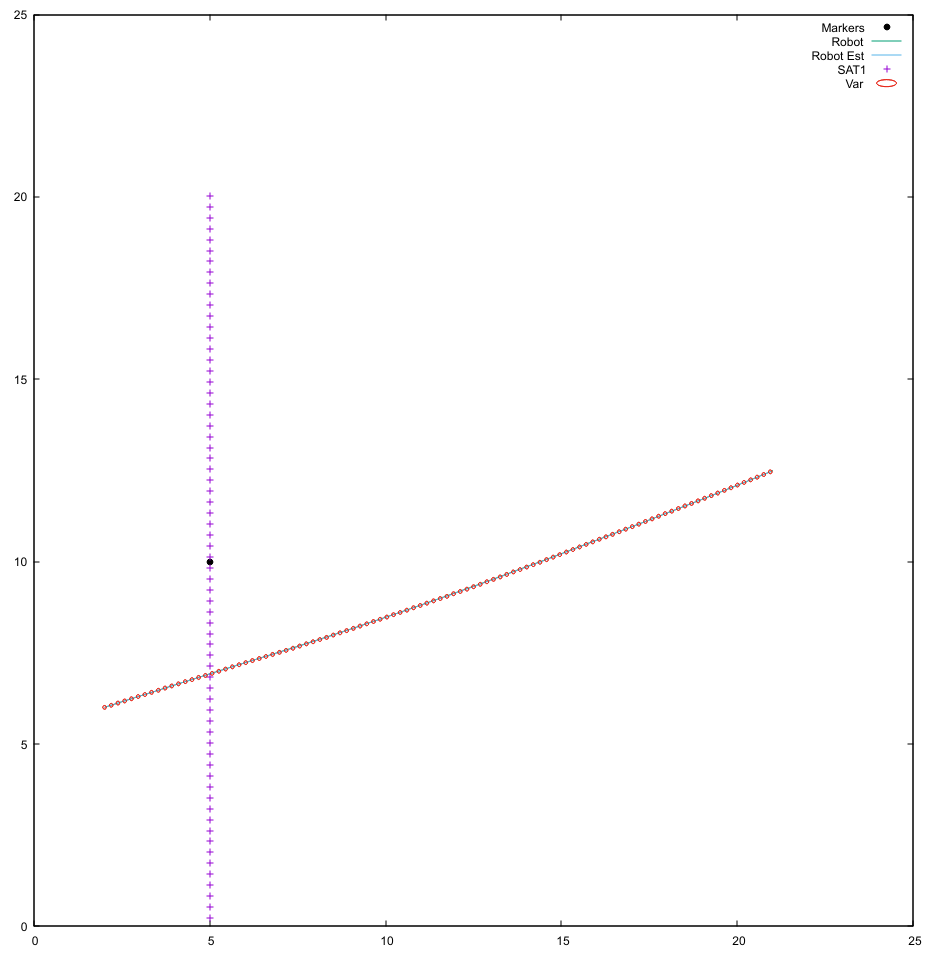
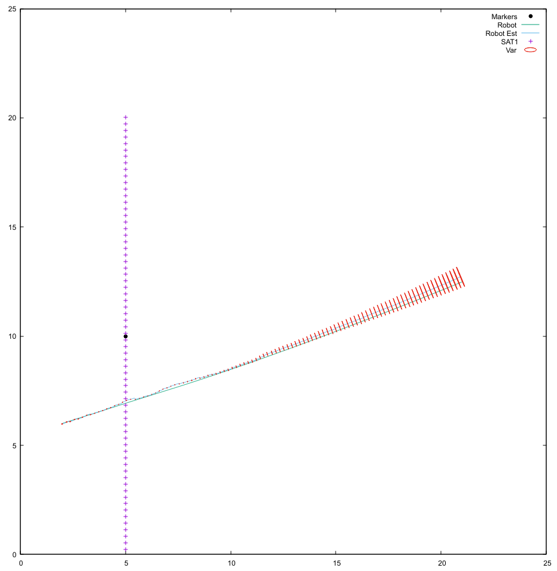
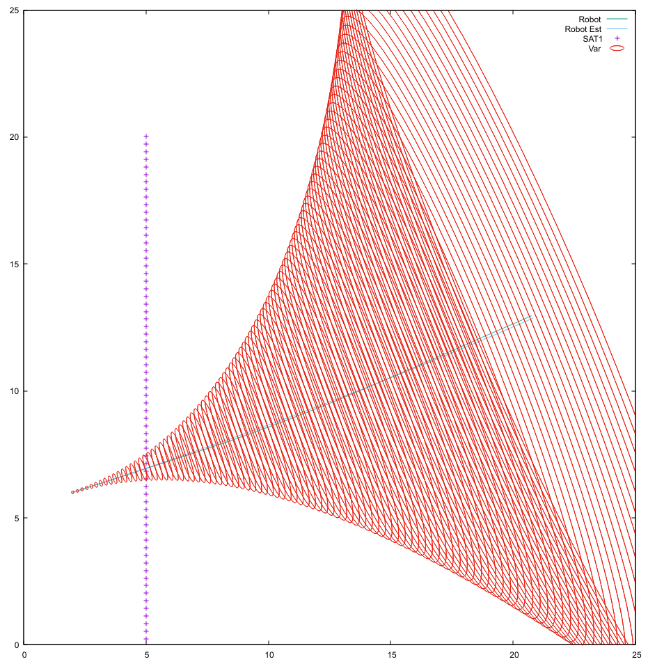
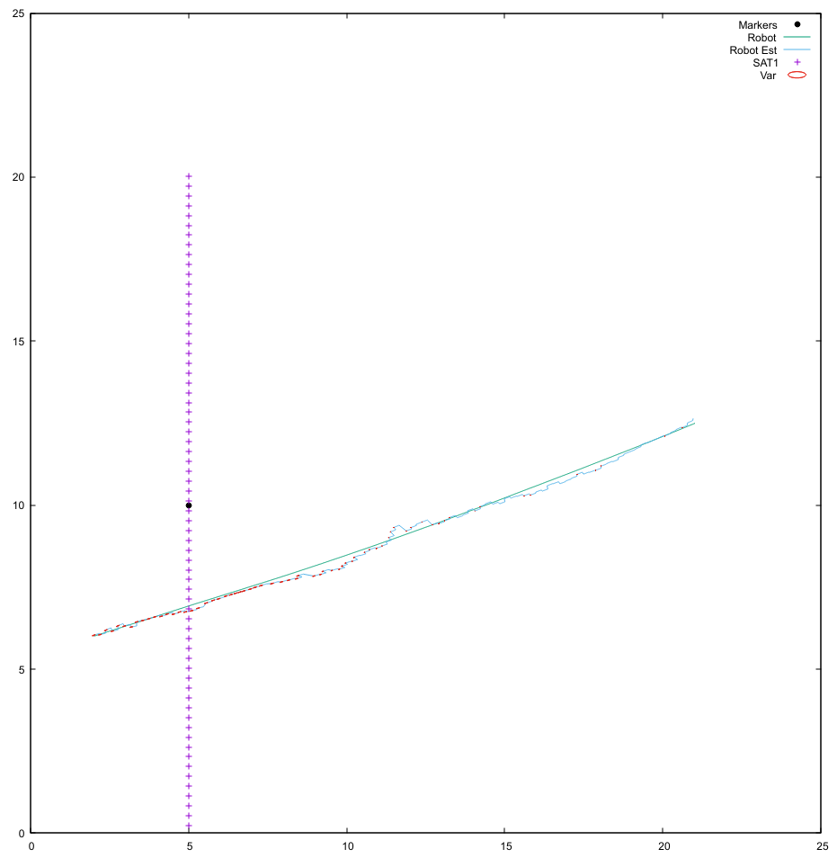

## Compass



\newpage

## Marker



\newpage
## Satellite


\newpage



\newpage

The compass plot differs from the satellite plot because the position estimate is always accurate but the bearing measurement varies. This leads to a consistent variance in the bearing measurement. The marker plot differs because as the robot moves further away from the marker the variance increases but the positional estimate of the robot remains relatively accurate. In the case of the satellite localization, the error fluctuates based on the satellite position although there is more jitter in the system due to noise associated with the satellite position. \

```cpp
/*
    Identical to jacobianH but with respect to distance
    output h:
        dx=sqrt( ex^2+ey*2)
*/
void Robot::jacobianHD(Eigen::MatrixXd &H, const Eigen::VectorXd &X, double px, double py) {
    double var = (px - X(0)) * (px - X(0)) + (py - X(1)) * (py - X(1));
    const double dist = sqrt(var); // Calculate the distance

    H << -(px - X(0)) / dist, -(py - X(1)) / dist, 0; // Take the derivative wrt distance
    // All negative by convention
    // Essentially remove the angle part of jacobianH
}

// HERE IS YOURS
// LOCALIZE ON SATELITES, DISTANCE ONLY
void Robot::LocalizeS(void) {
    Eigen::MatrixXd S (1, 1); // S is a 1x1 because of Rs
    Eigen::MatrixXd K (1, 3); // K is a 1x3 with x, y, theta
    Eigen::MatrixXd I (3, 3); // Identity
    I.setIdentity();
    Eigen::MatrixXd error (1, 1); // Only error for distance

    double sat_x; // Satellite x
    double sat_y; // Satellite y

    double real_x; // Robot -> satellite x
    double real_y; // Robot -> satellite y
    double real_dist; // Robot -> satellite distance

    double obs_x; // Robot est -> satellite x
    double obs_y; // Robot est -> satellite y
    double obs_dist; // Robot est -> satellite distance

    // For all  markers
    for (int i = 0; i < num_satellites; i++) {
        sat_x = satellites[i]->getX(); // get satellite x
        sat_y = satellites[i]->getY(); // get satellite y

        // Compute real point of reference
        real_x = sat_x - px; // From the robot to the satellite x
        real_y = sat_y - py; // From the robot to the satellite y
        real_dist = sqrt(real_x * real_x + real_y * real_y); // distance to the satellite
        real_dist += 0.2 * d_noise(generator); // Add noise to real reading

        // compute kalman robot  estimate
        obs_x = sat_x - X(0); // From estimate to satellite x
        obs_y = sat_y - X(1); // From estimate to satellite y
        obs_dist = sqrt(obs_x * obs_x + obs_y * obs_y); // From estimate to satellite distance

        error << real_dist - obs_dist; // calculate error distance
        /* std::cout << "ERROR " << error.format(fmt) << std::endl; */


        // Run the kalman filter for just distance

        jacobianHD(JHD, X, sat_x, sat_y); // JHD = 1x3
        /* std::cout << "JHD " << JHD.format(fmt) << std::endl; */

        S = JHD * P * JHD.transpose() + Rs; // Make sure to use Rs for satellite error
        /* std::cout << "S " << S.format(fmt) << std::endl; */

        K = P * JHD.transpose() * S.inverse();
        /* std::cout << "K " << K.format(fmt) << std::endl; */

        X = X + K * error;
        /* std::cout << "X " << X.format(fmt) << std::endl; */

        P = (I - K * JHD) * P;
        /* std::cout << "P " << P.format(fmt) << std::endl; */

        printf("Satellite %d Real Dist %f Obs Dist %f \n", i+1, real_dist, obs_dist);
    }
}
```
