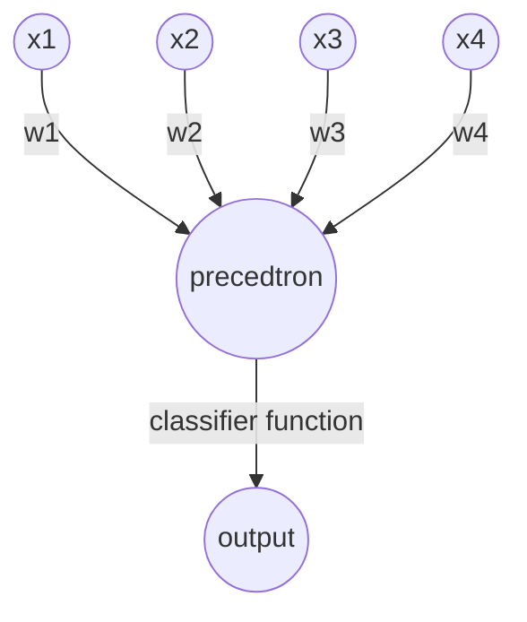

# Lecture 27

## AI

SVM = support vector machines
CNN = convolutional neural networks

## AI Topics

* Classify
* Regression "Learning Function - Model Fitting"
* Symbolic "Expert Systems"

## Learning

* Supervised learning (By example)
* Unsupervised learning (On your own)
* Re-enforcement learning (Bellman)

## Measurement of success

$(x^k, y^k)$ k = samples

$x^k$ = data, $y^k$ = class

Classifier cl

$cl(x^k) = y^k$

w = parameters

$ARGMIN \text{ w } \frac{1}{2} \sum_{k=0}^M || cl_w(x^k) - y^k ||^2$

x = predicted, y = expected

Can use gradient descent to solve

## Bayesian Classification

$(x^k, y^k)$ k = samples

$P(y^k | x^k) = \frac{P(x^k | y^k) P(x^k)}{y^k}$

What is the probability it is a monkey = # of monkeys * probability of seeing a monkey / all monkeys

$(x^k, y^k)$ = training data (80%)

$(\widetilde{x}^k, \widetilde{y}^k)$ = testing data (20%)

$P(y^k | x^k, x_1 ...)

## Linear Separable

Using different transformations to create data that you can linearly separate.

Class 1, Class 2

$P(1 | x)$ ---- $P(2 | x)$ --- Bayesian Classifier

$N(m_1 | \sigma_1) ---- N(m_2 | \sigma_2)$

$P(1|x) = p(2|x)$

$(x^k | y^k)$

$w^T x^k + b \begin{matrix} >0 \\ 1 \\ <0 \end{matrix}$

$x \epsilon R^m$ --- $w \epsilon R^m$

$x_{\text{dimension of vector}}^{\text{sample number}}$

$L = \frac{1}{2} \sum_{k=1}^M |f(w^T x^k + b) - y^k |^2$

L = loss function

$ ARGMIN \text{ w }$

$\frac{dL}{dw} = \sum (f(w^T x^k + b) - y^k)$

$w <- w + \delta \frac{dL}{dw}$

$\delta$ = learning rate

