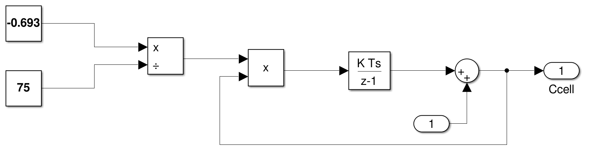

# 4QZ3 - A2 - 400138679 - suitorj

## Question 1

Results: \
* The integrator for Psa was set to Psai * Csa due to the immediate 1/Csa gain block. \
* The CLV(t) function was taken from the provided supplementary chapter. \
* The integrator for Plv was initially set to Plvi


\pagebreak
## Question 2

Assumptions: \
* That the drug is completely absorbed by the gut. \
* That drug concentration is only lost at the specified excretion points. \
* That there are no other substances which would alter the rates of absorption or excretion. \
* That the substance is split equally amongst the 3 excretory systems. \

Due to the system being modelled as an uncontrolled process, the drug is first brought in at the gut where it then is split 3 ways between the 3 excretory systems. In each system the concentration is reduced before being summed back together. Any drug concentration that has entered the body through the gut and has not been excreted must be in the blood which is why blood concentration is modelled by this system. \

Results: \
* It takes an initial dose of 1.75 followed by a dose every 90 minutes to eventually reach a steady state. \
* The concentration in the blood is not constant but the system does eventually reach a steady state. \


It can be seen from this figure that the drug concentration quickly reaches a steady state value due to the higher initial dose. \

\pagebreak
## Appendix

### Question 1 Code
```Matlab
Q1_init;
q1_out = sim("q1_model");

figure;
subplot(3, 1, 1);
plot(q1_out.clv.Time, q1_out.clv.Data)
title("CLV vs. Time")
ylim([0 .015])
yticks([0, 0.005, 0.01, 0.015])
xlabel("Time (min)" + newline + " ")
ylabel("CLV" + newline + "(L/mmHg)")

subplot(3, 1, 2);
hold on
plot(q1_out.plv_psa.Time, q1_out.plv_psa.Data(:, 1))
plot(q1_out.plv_psa.Time, q1_out.plv_psa.Data(:, 2))
title("Plv and Psa vs. Time")
ylim([0 120])
yticks([0, 20, 40, 60, 80, 100, 120])
legend("Plv", "Psa")
xlabel("Time (min)" + newline + " ")
ylabel("Plv and Psa" + newline + "(mmHg)")

subplot(3, 1, 3);
hold on
plot(q1_out.qmi_qao_qs.Time, q1_out.qmi_qao_qs.Data(:, 1), 'Color', 'b')
plot(q1_out.qmi_qao_qs.Time, q1_out.qmi_qao_qs.Data(:, 2), 'Color', 'g')
plot(q1_out.qmi_qao_qs.Time, q1_out.qmi_qao_qs.Data(:, 3), 'Color', 'r')
hold off
title("Qmi, Qao, Qs vs. Time")
legend("Qmi", "Qao", "Qs")
ylim([0 100])
yticks([0, 20, 40, 60, 80, 100])
xlim([0 0.2])
xlabel("Time (min)")
ylabel("Blood Flows" + newline + "(L/mmHg)")
```
\pagebreak

### Question 1 Simulink

#### Total System \


#### Mitral Subsystem \


#### Aortic Subsystem \


#### Systemic Subsystem \


#### Left Ventricle Subsystem \


\pagebreak
### Question 2 Code

```Matlab
q2_out = sim("q2_model");

figure;
subplot(4, 1, 1)
hold on
plot(q2_out.Cin)
plot(q2_out.dose)
hold off
legend("Cin", "Dose input")
ylabel("Dose")
xlabel("Time (min)" + newline + " ")
title("Dose and Cin vs. Time")

subplot(4, 1, 2)
hold on
plot(q2_out.Cout.Time, q2_out.Cout.Data(:, 1))
plot(q2_out.Cout.Time, q2_out.Cout.Data(:, 2))
plot(q2_out.Cout.Time, q2_out.Cout.Data(:, 3))
hold off
legend("Liver", "Cell", "Kidney")
ylabel("Con.")
xlabel("Time (min)" + newline + " ")
title("Cliver, Ccell, Ckidney vs. Time")

subplot(4, 1, 3)
plot(q2_out.Cout_tot)
ylim([75 125])
yticks([75, 100, 125])
ylabel("Dose (%)")
xlabel("Time (min)")
title("Blood concentration vs. Time")
```

\pagebreak
### Question 2 Simulink

#### Total System \


#### Gut Subsystem \


#### Liver Subsystem \


#### Kidney Subsystem \


#### Cell Subsystem \

